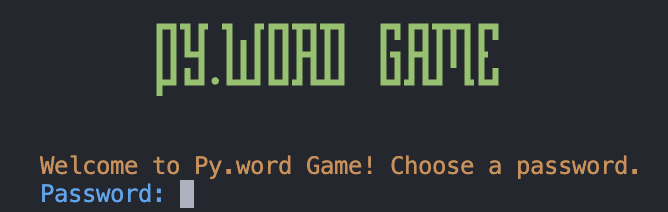

# Py.word Game - Password Creation and Validation Game
[](https://wakatime.com/badge/user/be00ec59-8c58-4a6d-b7bd-a8697292e551/project/c29db235-3b27-4be1-a5b5-82162d0cdf72)
> Welcome to Py.word Game, a Python-based password creation and validation game! This project was created as a submission by r.\_.uiz for the CS50P course offered by Harvard University, heavily inspired by [neal.fun's version.](https://neal.fun/password-game/)



- **Author:** r.\_.uiz
- **GitHub Profile:** [r._.uiz on GitHub](https://github.com/r-uiz)


## Table of Contents
- [About the Project](#about-the-project)
    - [Important Notes](#important-notes)
    - [Required Libraries](#required-libraries)
- [Game Rules](#game-rules)
- [Getting Started](#getting-started)
    - [Installation](#installation)
    - [Usage](#usage)
- [Documentation](#documentation)
    - [Functions](#functions)
    - [Configurable Default Variables](#configurable-default-variables)
    - [Pip-Installable Dependencies](#pip-installable-dependencies)
    - [Imported Modules](#imported-modules)
    - [What Can Be Improved](#what-can-be-improved)
        - [Someday additions](#someday-additions)
        - [Addtl rule ideas](#addtl-rule-ideas)
        - [Addtl notes](#addtl-notes)
- [Contributions](#contributions)

---
## About the Project
Trying to up your account security? Look no further. These curious rules for a password will surely be enough. Heavily inspired by [The Password Game](https://neal.fun/password-game/) by [neal.fun](https://neal.fun/), the Py.word Game is a password creation and validation game that challenges users to create a secure password while following a set of rules. 

#### Video Demo:  <URL HERE>


> Created to fulfill the [requirements](https://cs50.harvard.edu/python/2022/project/) for [Harvard's CS50P](https://pll.harvard.edu/course/cs50s-introduction-programming-python), a Computer Science course focused on [Python](https://www.python.org/).

### Important Notes

- This is my first Python program, so I apologize for any bad practices.
- Feel free to leave any feedback on how I can improve my code!

### Required Libraries

This project relies on the following pip-installable libraries, which is listed one per line in a `requirements.txt` file in the root of the directory:
```
pyperclip
requests
pillow
colorama
captcha
```

---
## Game Rules
> Don't ruin the fun! Play the game first before reading this section ;)

The Py.word Game enforces the following rules for password creation:

1. Password must be at least `5` characters long.
2. Password has a `50` character limit.
3. Password must include a `number`.
4. Password must contain a `special` character and `no whitespace`.
5. Password must contain an `uppercase` letter.
6. The digits in your password must add up to the `self.sum_target` whose default is `69`.
7. Password must have the date today in `YYYY-MM-DD` format.
8. Password must include at least one of a randomly generated Pokémon's `type`.
9. Password must include the regenerating code in the `captcha.png`/`captcha.wav` in the same directory as this program.
10. Password must have the `flag emoji` of a country whose name/country code starts with the letter `P`.
11. Password must include the `month` we're currently in.
12. Password must have a `food emoji`.
13. Password must include the current time in `HH:MM` military time format.

If the password doesn't follow a rule, the user will be prompted to try again until all requirements are met.

---
## Getting Started
- To get started with the Pyword Game, you'll need a Python environment set up on your computer. 
### Installation

1. Clone the repository to your local machine:

```bash
git clone https://github.com/r-uiz/py.word-game.git
```

2. Navigate to the project directory

```bash
cd py.word-game
```

3. Install the required libraries by running the following command:

```bash
pip install -r requirements.txt
```

### Usage
1. Run the Pyword Game:

```bash
python project.py

```

2.  Follow the on-screen instructions to create a password that meets all the specified rules.

3.  Once you successfully create a valid password, the game will display a success message along with the time you took to complete the game.

---
## Technical Documentation


### Functions
1. `min_length_reqs`
    > - Uses the `len()` function to check if the length of the password is more than or equal to a configurable default value of 5. Rule 1.
2. `max_length_reqs`
    > - Uses the `len()` function to check if the length of the password is less than or equal to a configurable default value of 50. Rule 2.
3. `has_number_reqs`
    > - Uses the `any()` function to check if any of the characters in the password is a number. Rule 3.
4. `has_special_reqs`
    > - Uses the `any()` function to check if any of the characters in the password is a special character and the `isspace()` function to check if any of the characters in the password is a whitespace. Rule 4.
5. `has_upper_reqs`
    > - Uses the `any()` function to check if any of the characters in the password is an uppercase letter. Rule 5.
6. `sum_reqs`
    > - Iterates through each character in the password, assessing if it is a digit, and adding it to a configurable expected value of `self.sum_target` which defaults to `69`. Rule 6.
7. `date_today_reqs`
    > - Uses the `datetime` library to get the current date and formatting it to `YYYY-MM-DD` str format, and checking if it is in the password. Rule 7.
8. `fetch_random_pokemon`
    > - Uses the `requests` library to fetch a `random` Pokémon from the [PokéAPI](https://pokeapi.co/) gets its `name`, `type` list, and `sprite`. Pops up its sprite with the default image viewer, and return's the chosen Pokémon's name and type/s. Defaults to `Bulbasaur` values if API call fails. Rule 8.

9. `reset_pokemon`
    > - Resets the Pokémon counter to 0, and fetches a new Pokémon with `fetch_random_pokemon`. Used when the configurable default value of 3 is reached. Rule 8.

10. `wild_pokemon_reqs`
    > - Main validator that calls `fetch_random_pokemon` on first initialization, and `reset_pokemon` if the configurable default value of 3 is reached. Uses the `any()` function to check if any of the Pokémon's types are in the password. Rule 8.

11. `generate_captcha`
    > - Uses the `string` library to generate and return a captcha code with the configurable default values of `string.ascii.lowercase` and `string.digits`. Rule 9.

12. `generate_audio_captcha`
    > - Uses the `captcha` library to generate an audio captcha with the returned value of `generate_captcha`. Writes the audio captcha to [captcha.wav](captcha.wav). Rule 9.

13. `generate_image_captcha`
    > - Uses the `captcha` library to generate an image captcha with the returned value of `generate_captcha`. Writes the image captcha to [captcha.png](captcha.png). Rule 9.

14. `reset_captcha`
    > - Resets the captcha counter to 0, and generates a new captcha with `generate_captcha`. Used when the configurable default value of 5 is reached. Rule 9.

15. `captcha_reqs`
    > - Main validator for captcha rules, and `reset_captcha` if the configurable default value of 5 is reached. Rule 9.

16. `flag_reqs`
    > - Checks if any character of the password is in the [validFlag.txt](validFlag.txt) file. Rule 10.

17. `month_reqs`
    > - Uses the `datetime` library to get the current month and formatting it to the full name str format, and checking if it is in the password. Rule 11.

18. `food_reqs`
    > - Checks if any character of the password is in the [validFood.txt](validFood.txt) file. Rule 12.

19. `time_now_reqs`
    > - Uses the `datetime` library to get the current time and formatting it to `HH:MM` military time str format, and checking if it is in the password. Rule 13.

20. `validate`
    > - Calls all the above `reqs` functions to validate the password. Returns True if all requirements are met, and False if not.

20. `confirm`
    > - If input is finally valid, this is called to reset user's clipboard & start a timer. If user's manually-inputted password is the same as the previously valid password, and before the configurable default value of 30 seconds, returns True. If not the same or time elapsed is over 30 seconds, returns False.

21. `format_elapsed_time`
    > - Formats the elapsed time float to a readable natural-language format using `timedelta`. Returns the formatted string.

21. `clear_terminal`
    > - Clears the terminal screen to make the game more readable and less cluttered of the constant prompts.

22. `__init__`
    > - Initializes the game with configurable default values seen in [Configurable Default Variables](#configurable-default-variables).

23. `main`
    > - Main game loop that introduces the game and asks for input of which will be tested against the requirements in `validate`. If valid, will ask for confirmation with `confirm`. Also handles the Ctrl+C `KeyboardInterrupt` exception and `pyperclip` clipboard copying.

### Configurable Default Variables
1. `self.captcha_options`
    > - Configurable default value for the `generate_captcha` function. Defaults to `string.ascii.lowercase` + `string.digits`.
2. `self.captcha_range`
    > - Configurable default value for the `generate_captcha` function. Defaults to 5.
3. `self.captcha_attempt_limit` 
    > - Configurable default value for the `captcha_reqs` function. Defaults to 5.
4. `self.poke_attempt_limit`
    > - Configurable default value for the `wild_pokemon_reqs` function. Defaults to 3.
5. `self.min_length`
    > - Configurable default value for the `min_length_reqs` function. Defaults to 5.
6. `self.max_length`
    > - Configurable default value for the `max_length_reqs` function. Defaults to 50.
7. `self.sum_target`
    > - Configurable default value for the `sum_reqs` function. Defaults to 69.
8. `self.confirm_time_limit`
    > - Configurable default value for the `confirm` function. Defaults to 30 seconds.

### Pip-Installable Dependencies
- `pyperclip`
    - Used to copy attempt to the user's clipboard for easier input in the loop, and to reset the clipboard once on the confirmation stage.
- `requests`
    - Used to fetch a random Pokémon from the [PokéAPI](https://pokeapi.co/) required by Rule 8.
- `pillow`
    - Used to display the Pokémon's sprite with the default image viewer required by Rule 8.
- `colorama`
    - Used to color the text outputted to the terminal.
- `captcha`
    - Used to generate the captcha code and audio/image captcha files required by Rule 9.

### Imported Modules
- `os`
    - Used to clear the terminal screen.
- `sys`
    - Used to exit the program.
- `time`
    - Used to calculate the elapsed time in the `confirm` function and total elapsed time in the `main` function.
- `string`
    - Used to generate the captcha code in the `generate_captcha` function.
- `random`
    - Used to generate the captcha code in the `generate_captcha` function and to choose a random Pokémon in the `fetch_random_pokemon` function.
- `readline`
    - Used for easier input editing in the terminal.
- `io`
    - Used to generate the captcha files in the `captcha` functions.
- `pathlib`
    - Used to get the current directory of the program.
- `datetime`
    - Used to get the current date and time in related `time/date` functions, and `timedelta`.

### What Can Be Improved
#### Someday additions:
- [ ] add a visual for the timer in the time requirement for the confirm function (maybe a progress bar?)
- [ ] add functionality to disable colored text outputting (using argparse, for example)
    - [ ] with this, add configurability flags for any default values (like the max length of the password, number of tries for captcha, etc.)
- [ ] completely disable clipboard pasting in confirm function (Can just be pasted again if you have a clipboard manager)
    - [ ] In my terminal I could also just press the up arrow key to get the previous input, so maybe disable that too?
- [ ] add more rules! [see below](#addtl-rule-ideas)
    - Hopefully more that requires user to search for a solution (like the pokemon one) on the Internet like neal.fun's version. (Chess notation, Geoguessr, etc.)
    - Even more interactive ones.
- [ ] Finish unit test file (Pokémon and captcha tests are incomplete. Mainly because of lack of knowledge on how to test them since they include API Calls and file generation)
- [ ] add a GUI for easier input and prettier overall. Check out: [tkinter](https://docs.python.org/3/library/tkinter.html) or [PyQt](https://riverbankcomputing.com/software/pyqt/intro)

#### Addtl rule ideas:
- ~~Retype the valid password to confirm~~ added!
- ~~add numbers to captcha (fun lil challenge, bit of an annoyance but its a game, no?)~~ added!
- ~~lower max limit (might be too limiting)~~ configurable!
- include total length of password (will mess with current answers in int-based reqs)
- must include a palindrome that has a minimum of 5 characters and is not a number.
- With a set of ten letters, must include a valid word that uses some of the letters given. Regenerates new set every time you get it wrong. (easier reset if impossible to make word)
- give broken code. add the needed solution to the password
- randomly generate a Terminal chess board and ask for a best move (maybe use chess notation)
- randomly generate emoji set and ask for what movie it means (🚢🧊💔 = Titanic)
- Hmm... needs more RGB. Add emojis that are red, green, and blue. (🔴🟢🔵)

#### Addtl notes:
- `Int`-based requirements, especially `Rule 6: Sum` and `Rule 13: HH:MM` are quite the hassle later on (that's the point; should be a challenge) But I understand your struggle! (hell, imagine testing the code for yourself!); [this tool that I wrote](https://www.online-python.com/SEMPZn3TDb) (which is basically the `sum_reqs` function) would be useful just so editing attempts in real time would be less of a hassle since these requirements mingle, and you'll be out of the terminal.

- Best to add the emojis in the beginning of the string. It's a hassle to use the arrow keys when passing over country flags and other emoji since it modifies it visually and turns out your cursor is not at right spot. (I'm not sure if this is a problem with my terminal or the code itself, but it's a problem nonetheless)

- Emojis may not necessarily be 1 character, which will be confusing for the char limit functions.
---
## Contributions

You are welcome to contribute to this project by providing feedback or suggestions for improvement. If you encounter any issues or have ideas for enhancements, please open an issue or submit a pull request.

### Contribution Guidelines

1.  Fork the repository.
2.  Create a new branch for your feature or bug fix: `git checkout -b feature-name`.
3.  Make your changes and commit them: `git commit -am 'Add feature'`.
4.  Push to the branch: `git push origin feature-name`.
5.  Create a pull request.

[Back to Top](#table-of-contents)
[License](LICENSE.txt)


---

